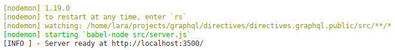

Slides available at this [link](http://bit.ly/graphql-directives-why-and-how).

# GraphQL Directives - Why and How?

## Introduction

On this repository I have created a basic example about how to use GraphQL Directives, based on [Apollo Server](https://www.apollographql.com/docs/apollo-server/) and [graphql-tools](https://github.com/apollographql/graphql-tools).

The example works around how to control the access to specific fields of an object type, depending on the role which owns the user who is running the request.

## Needed resourses

In order to run this example scrtip, it's recomended to have installed in your system the next applications:

- Version control system [Git](https://git-scm.com/), version 2.7 or highger.
- [NodeJS](https://nodejs.org/es/download/current/), version 11.12.0 or highger.
- Requests manager [Insomnia REST](https://insomnia.rest/), version 6.3.2 or highger.
- Code editor [Visual Studio Code](https://code.visualstudio.com/), versión 1.32 or highger, with the next extensions installed:
    - [ESLint](https://marketplace.visualstudio.com/items?itemName=dbaeumer.vscode-eslint).
    - [GraphQL for VSCode](https://marketplace.visualstudio.com/items?itemName=kumar-harsh.graphql-for-vscode).
    - [npm Intellisense](https://marketplace.visualstudio.com/items?itemName=christian-kohler.npm-intellisense).

## Environment configuration

First at all, you need to clone this repository and install the needed NPM modules, following the next steps:

```sh
$ git clone https://github.com/ddialar/graphql.directives.101
$ cd graphql.directives.101
$ npm i
```

If everything was fine, you can start to working on.

After that, you need to load the requests defined for Insomnia which are into the [docs/insomnia/requests.json](https://github.com/ddialar/graphql.directives.101/tree/master/docs/insomnia) file.

In order to do that, open Insomnia and surf to `Application > Preferences > Data > Import Data > From File`. Now surf on your file system until the file is located and select it.

Once the file content has been loaded successfully, you must click in the workspaces combobox and select the `GQL Directives` one.

The last step is to click in the environments combobox and select the `Development` one.

That is all.

## Repository structure

This repository contains two branches: `master` and `auth_directive`.

### Branch `master`

This branch contains a pretty basic GraphQL API based on Apollo Server.

Once you have installed all needed modules, you can run the server executing the next command:

```sh
$ npm run dev
```



Now, with Insomnia open, you can run the request `Get all users` contained into the `No Directives` folder.

You can check that if you run the query (`ctrl + enter` or `cmd + enter`), you receive the whole users data, without any restriction.

### Branch `auth_directive`

At this brach directives are implemented.

Into the [src/graphql](https://github.com/ddialar/graphql.directives.101/tree/auth_directive/src/graphql) folder, you will find a new dolder named `directives` where the `AuthDirective` business logic is implemented.

In addition, if you check the [schema.graphql](https://github.com/ddialar/graphql.directives.101/blob/auth_directive/src/graphql/schema.graphql) file, you can see that it has been also edited in order to define the `@auth` directive.

Now, comming back to Insomnia, you can run the request `Get all users GUEST` contained into the `Auth Directive` folder.

You can check that if you run the query (`ctrl + enter` or `cmd + enter`), you receive a non authorized error.

```json
// Obtained result.
{
    "errors": [
        {
            "message": "401 - Non Authorized",
            "locations": [
                {
                    "line": 5,
                    "column": 5
                }
            ],
    ...
}
```

However, if you edit the request commenting or deleting all fields except `name` and `surname`, and you run the query again, you will receive users data successfully.

```graphql
# Edited request.
query {
  getAllUsers {
    name
    surname
#     role
#     token
#     createdAt
#     lastLoginAt
  }
}
```

```json
// Obtained result.
{
    "data": {
        "getAllUsers": [
            {
                "name": "John",
                "surname": "Doe"
            },
            {
                "name": "Dailos",
                "surname": "Díaz"
            }
        ]
    }
}
```

We obtaine this API's behaviour because the `@auth` directive is applied to specific fields of the object type and this user who is placing the request has not enough authorization role in order to get that fields information.

Finally, if you can run the request `Get all users SYSADMIN` contained into the `Auth Directive` folder, you will be able to get the whole users data without any issue. That happends because this user owns the needed role level in order to receive data. 