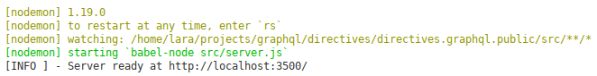

# GraphQL Directives - Why and How?

## Introducción

En este repositorio he creado un ejemplo muy básico sobre cómo implmementar Directivas en GraphQL, basándome en [Apollo Server](https://www.apollographql.com/docs/apollo-server/) y [graphql-tools](https://github.com/apollographql/graphql-tools).

Este ejemplo gira en torno a cómo controlar el acceso a determinados campos de un objeto tipo, dependiendo del rol que posea, el usuario que está realizando la petición.

## Recursos necesarios

Para ejecutar este ejemplo, se recomienda que dispongas de las siguientes herramientas en el equipo informático donde vayas a trabajar:

- Gestor de versiones [Git](https://git-scm.com/), versión 2.7 o superior.
- [NodeJS](https://nodejs.org/es/download/current/), versión 11.12.0 o superior.
- Gestor de peticiones [Insomnia REST](https://insomnia.rest/), versión 6.3.2 o superior.
- Editor de código [Visual Studio Code](https://code.visualstudio.com/), versión 1.32 o superior, con las siguientes extensiones instaladas:
    - [ESLint](https://marketplace.visualstudio.com/items?itemName=dbaeumer.vscode-eslint).
    - [GraphQL for VSCode](https://marketplace.visualstudio.com/items?itemName=kumar-harsh.graphql-for-vscode).
    - [npm Intellisense](https://marketplace.visualstudio.com/items?itemName=christian-kohler.npm-intellisense).

## Configuración del entorno

Para empezar, necesitas clonar el repositorio e instalar lo módulos NPM necesarios, siguiendo estos pasos:

```sh
$ git clone https://github.com/ddialar/graphql.directives.101
$ cd graphql.directives.101
$ npm i
```

Si todo ha ido bien, podemos empezar a trabajar.

Después de esto, ahora necesitas cargar las peticiones definidas para Insomnia, las cuales están dentro del archivo [docs/insomnia/requests.json](https://github.com/ddialar/graphql.directives.101/tree/master/docs/insomnia).

Para hacer esto, arranca Insomnia y navega hasta `Application > Preferences > Data > Import Data > From File`. Ahora busca en tu sistema de archivos, dónde está localizado el archivo con las peticiones y selecciónalo.

Una vez que el contenido del archivo se ha cargado correctamente, debes desplegar el combo de workspaces y seleccionar el workspace llamado `GQL Directives`.

El último paso es hacer clic en el combo de *environments* y seleccionar el entorno denominado `Development`.

Esto es todo.

## Estructura del repositorio

Este repositorio está dividido en dos ramas: `master` and `auth_directive`.

### Rama `master`

Esta rama contiene una API GraphQL muy básica, basada en Apollo Server.

Una vez tienes instalados todos los módulos necesarios, puedes arrancar el servidor ejecutando este comando:

```sh
$ npm run dev
```



Ahora, con Insomnia, puede ejecutar la petición `Get all users` que está dentro del directorio `No Directives`.

Puedes verificar que si lanzas la petición (`ctrl + enter` or `cmd + enter`), recibes todos los datos de los usuarios, sin ningún tipo de restricción.

### Rama `auth_directive`

En esta rama es donde están implementadas las directivas.

Dentro del directorio [src/graphql](https://github.com/ddialar/graphql.directives.101/tree/auth_directive/src/graphql), podrás encontrar un nuevo subdirectorio llamado `directives` donde está implementada la lógica de negocio de la directiva `AuthDirective`.

Además, si miras el archivo [schema.graphql](https://github.com/ddialar/graphql.directives.101/blob/auth_directive/src/graphql/schema.graphql), verás que éste ha sido modificado para definir la directiva `@auth`.

Ahora si volvemos a Insomnia, puedes ejecutar la petición `Get all users GUEST` que está dentro del directorio `Auth Directive`.

Puedes comprobar que al ejecutar la consulta (`ctrl + enter` or `cmd + enter`), recibes un error por no estar autorizada la petición.

```json
// Obtained result.
{
    "errors": [
        {
            "message": "401 - Non Authorized",
            "locations": [
                {
                    "line": 5,
                    "column": 5
                }
            ],
    ...
}
```

Sin embargo, si editas la peticion comentando o eliminando todos los campos **menos** `name` y `surname`, y ejecutas la consulta de nuevo, podrás recibir esos datos de usuario, sin problemas.

```graphql
# Edited request.
query {
  getAllUsers {
    name
    surname
#     role
#     token
#     createdAt
#     lastLoginAt
  }
}
```

```json
// Obtained result.
{
    "data": {
        "getAllUsers": [
            {
                "name": "John",
                "surname": "Doe"
            },
            {
                "name": "Dailos",
                "surname": "Díaz"
            }
        ]
    }
}
```

Obtenemos este comportamiento de la API porque la directiva `@auth` está aplicada a campos concretos del objeto tipo y el usuario que está realizando la petición, no tiene la suficiente autorización como para obtener la información de dichos campos.

Finalmente, si ahora ejecutas la consulta `Get all users SYSADMIN` que está dentro del directorio `Auth Directive`, obtendrás todos los datos del usuario sin problemas. Esto sucede porque este usuario sí que posee el rol necesario como para poder acceder a todos los datos.